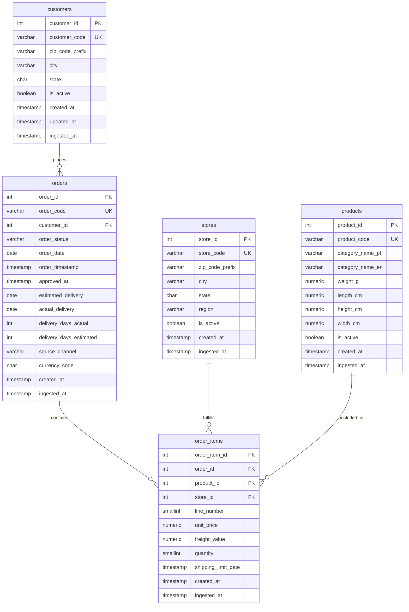

# Source System Schema Documentation

## Overview

The `source_system` PostgreSQL schema is the landing zone (Bronze layer) for the Multi-Source ETL pipeline. It simulates an enterprise-class data warehouse staging area, receiving cleansed and deduplicated data from the Brazilian E-Commerce dataset published by Olist on Kaggle.

The Olist dataset represents approximately 100,000 orders placed between September 2016 and October 2018 across 27 Brazilian states. It captures the full e-commerce transaction lifecycle including customers, merchants (sellers), products, orders, and line items. The `source_system` schema refactors this raw multi-file dataset into a normalized, keyed enterprise structure with surrogate keys, business keys, status tracking, and audit timestamps.

Unlike a raw dump schema, `source_system` enforces data integrity through:
- **Integer surrogate keys** (SERIAL) for efficient joins and storage
- **VARCHAR business keys** (customer_code, store_code, product_code, order_code) mapping back to Olist source identifiers
- **Consistency columns** (is_active, created_at, updated_at, ingested_at) required in modern data warehouses
- **Derived columns** (region, delivery_days_actual, delivery_days_estimated) pre-computed for analytical convenience
- **Foreign key constraints** ensuring referential integrity

Data flows from `source_system` through a Silver layer (data quality, enrichment, slow-change dimensions) and into a Gold analytics schema for BI consumption.

---

## Entity-Relationship Diagram



---

## Table Reference

### `source_system.customers`

Deduplicates Olist's per-order customer records into a persistent customer registry. Maps Olist's `customer_unique_id` (the true business identifier for a physical shopper) to a surrogate key. One row per unique customer.

| Column | Type | Key / Nullable | Description |
|---|---|---|---|
| customer_id | SERIAL | PK, NOT NULL | Integer surrogate key; auto-incrementing |
| customer_code | VARCHAR(32) | UNIQUE, NOT NULL | Business key mapping to Olist `customer_unique_id`; uniquely identifies the physical shopper |
| zip_code_prefix | VARCHAR(8) | NULL | Brazilian zip code prefix (5 digits) from customer's registered address |
| city | VARCHAR(100) | NULL | City name of customer's address |
| state | CHAR(2) | NULL | Two-letter Brazilian state abbreviation (e.g., SP, RJ, MG) |
| is_active | BOOLEAN | NOT NULL, DEFAULT TRUE | Soft-delete flag; TRUE means customer is active in the system |
| created_at | TIMESTAMP | NOT NULL | Record insertion timestamp (typically at first customer ingestion) |
| updated_at | TIMESTAMP | NOT NULL | Timestamp of last update; maintained by trigger on UPDATE |
| ingested_at | TIMESTAMP | NOT NULL | Pipeline ingestion timestamp; aids incremental load tracking |

**Estimated row count:** ~99,400

**Indexes:**
- PK on `customer_id`
- UNIQUE on `customer_code`
- Non-unique on `state` (for geographic filtering)

---

### `source_system.stores`

Registry of merchant sellers who fulfill orders. Maps Olist's `seller_id` to a surrogate key. Enriches basic location data with derived Brazilian region codes (a semantic grouping of states for analytical queries).

| Column | Type | Key / Nullable | Description |
|---|---|---|---|
| store_id | SERIAL | PK, NOT NULL | Integer surrogate key; auto-incrementing |
| store_code | VARCHAR(32) | UNIQUE, NOT NULL | Business key mapping to Olist `seller_id`; uniquely identifies the merchant |
| zip_code_prefix | VARCHAR(8) | NULL | Brazilian zip code prefix (5 digits) of seller's location |
| city | VARCHAR(100) | NULL | City where seller operates |
| state | CHAR(2) | NULL | Two-letter Brazilian state abbreviation |
| region | VARCHAR(30) | NULL | Derived region grouping: Norte, Nordeste, Sudeste, Sul, or Centro-Oeste (computed from state) |
| is_active | BOOLEAN | NOT NULL, DEFAULT TRUE | Soft-delete flag; TRUE means seller is actively fulfilling orders |
| created_at | TIMESTAMP | NOT NULL | Record insertion timestamp |
| ingested_at | TIMESTAMP | NOT NULL | Pipeline ingestion timestamp |

**Estimated row count:** ~3,100

**Indexes:**
- PK on `store_id`
- UNIQUE on `store_code`
- Non-unique on `region` (for regional rollups)

---

### `source_system.products`

Product catalogue. Contains merchandise attributes (weight, dimensions) and category mappings in both Portuguese (source language) and English (analytics standard).

| Column | Type | Key / Nullable | Description |
|---|---|---|---|
| product_id | SERIAL | PK, NOT NULL | Integer surrogate key; auto-incrementing |
| product_code | VARCHAR(32) | UNIQUE, NOT NULL | Business key mapping to Olist `product_id`; uniquely identifies the product |
| category_name_pt | VARCHAR(100) | NULL | Original Portuguese category name from Olist source |
| category_name_en | VARCHAR(100) | NULL | English translation of category (NULL for 3 uncategorised products with no translation) |
| weight_g | NUMERIC(10,2) | NULL | Shipping weight in grams (NULL if product is digital/no shipping) |
| length_cm | NUMERIC(6,2) | NULL | Package length in centimetres |
| height_cm | NUMERIC(6,2) | NULL | Package height in centimetres |
| width_cm | NUMERIC(6,2) | NULL | Package width in centimetres |
| is_active | BOOLEAN | NOT NULL, DEFAULT TRUE | Soft-delete flag; TRUE means product is available for sale |
| created_at | TIMESTAMP | NOT NULL | Record insertion timestamp |
| ingested_at | TIMESTAMP | NOT NULL | Pipeline ingestion timestamp |

**Estimated row count:** ~32,950

**Indexes:**
- PK on `product_id`
- UNIQUE on `product_code`
- Non-unique on `category_name_pt` and `category_name_en` (for category-based filtering)

---

### `source_system.orders`

Core transaction log. One row per customer order. Tracks the full order lifecycle with multiple date columns capturing business dates (order_date) and operational timestamps (order_timestamp, approved_at, etc.). Pre-computed delivery interval columns support time-series analytics without runtime SQL calculations.

| Column | Type | Key / Nullable | Description |
|---|---|---|---|
| order_id | SERIAL | PK, NOT NULL | Integer surrogate key; auto-incrementing |
| order_code | VARCHAR(32) | UNIQUE, NOT NULL | Business key mapping to Olist `order_id`; uniquely identifies the order |
| customer_id | INT | FK, NOT NULL | Foreign key to `source_system.customers`; the customer who placed this order |
| order_status | VARCHAR(20) | NOT NULL | Current order status; valid values: delivered, shipped, canceled, unavailable, invoiced, processing, created, approved |
| order_date | DATE | NOT NULL | Date portion of purchase timestamp (Brasília local time, UTC-3); used for business reporting |
| order_timestamp | TIMESTAMP | NOT NULL | Full purchase datetime when customer submitted order (Brasília local time) |
| approved_at | TIMESTAMP | NULL | Payment approval timestamp (NULL if order was cancelled without approval) |
| estimated_delivery | DATE | NULL | Carrier's estimated delivery date communicated at purchase (NULL for cancelled/unavailable) |
| actual_delivery | DATE | NULL | Date package was delivered to customer (NULL if not yet delivered) |
| delivery_days_actual | INT | GENERATED | Computed as `actual_delivery - order_date`; PostgreSQL DATE subtraction returns integer days directly; NULL if order not yet delivered |
| delivery_days_estimated | INT | GENERATED | Computed as `estimated_delivery - order_date`; PostgreSQL DATE subtraction returns integer days directly; NULL if no estimate |
| source_channel | VARCHAR(30) | NOT NULL, DEFAULT 'online' | Sales channel; always 'online' in this dataset (reserved for future multi-channel support) |
| currency_code | CHAR(3) | NOT NULL, DEFAULT 'BRL' | ISO 4217 currency code; all Olist prices are in Brazilian Real (BRL) |
| created_at | TIMESTAMP | NOT NULL | Record insertion timestamp |
| ingested_at | TIMESTAMP | NOT NULL | Pipeline ingestion timestamp |

**Estimated row count:** ~99,440

**Indexes:**
- PK on `order_id`
- UNIQUE on `order_code`
- FK on `customer_id`
- Non-unique on `order_date` (for time-series queries by business date)
- Non-unique on `order_status` (for status-based filtering)

---

### `source_system.order_items`

Line-item details for each order. An order may span multiple items from multiple stores. Quantity is always 1 in this dataset (one row per unit shipped), but the column structure supports future scenarios with higher quantities.

| Column | Type | Key / Nullable | Description |
|---|---|---|---|
| order_item_id | SERIAL | PK, NOT NULL | Integer surrogate key; auto-incrementing |
| order_id | INT | FK, NOT NULL | Foreign key to `source_system.orders`; the order containing this item |
| product_id | INT | FK, NOT NULL | Foreign key to `source_system.products`; the product being ordered |
| store_id | INT | FK, NOT NULL | Foreign key to `source_system.stores`; the seller fulfilling this line |
| line_number | SMALLINT | NOT NULL | Sequential position within the order (olist `order_item_id`, 1-based); supports multi-item orders |
| unit_price | NUMERIC(12,2) | NOT NULL | Item sale price in BRL at time of order (currency is BRL per order.currency_code) |
| freight_value | NUMERIC(12,2) | NOT NULL | Shipping cost component for this line in BRL |
| quantity | SMALLINT | NOT NULL, DEFAULT 1 | Number of units ordered on this line; always 1 in the current dataset (one row per unit) |
| shipping_limit_date | TIMESTAMP | NOT NULL | Deadline by which seller must hand off to carrier (per Olist SLA) |
| created_at | TIMESTAMP | NOT NULL | Record insertion timestamp |
| ingested_at | TIMESTAMP | NOT NULL | Pipeline ingestion timestamp |

**Estimated row count:** ~112,650

**Indexes:**
- PK on `order_item_id`
- FK on `order_id`
- FK on `product_id`
- FK on `store_id`
- Non-unique on `(order_id, line_number)` for line-item reconstruction

---

## Key Indexes

The following indexes support common query patterns:

- **`customers.customer_code` (UNIQUE)** — Fast business-key lookups during incremental loads
- **`stores.store_code` (UNIQUE)** — Deduplication on reload
- **`products.product_code` (UNIQUE)** — Product dimension lookups
- **`orders.order_code` (UNIQUE)** — Order presence checks and deduplication
- **`orders.customer_id` (FK)** — Customer order rollups (e.g., count orders per customer)
- **`orders.order_date`** — Date-range queries and time-series partitioning
- **`orders.order_status`** — Status-based reporting (e.g., count by status)
- **`order_items.order_id` (FK)** — Item reconstruction per order
- **`order_items.product_id` (FK)** — Product popularity analysis
- **`order_items.store_id` (FK)** — Seller performance metrics
- **`(order_items.order_id, order_items.line_number)` (compound)** — Efficient retrieval of specific line items
- **`stores.region`** — Regional aggregations
- **`customers.state`, `stores.state`** — State-level reporting

---

## Source Mapping

This table documents the transformation from Olist CSV files into `source_system` tables:

| Source CSV | Source Column | Target Table | Target Column | Transformation |
|---|---|---|---|---|
| olist_customers_dataset.csv | customer_unique_id | source_system.customers | customer_code | Direct map; deduplication key (one row per physical person) |
| olist_customers_dataset.csv | customer_id | (join bridge only) | — | Per-order UUID used only to join orders CSV → customer_unique_id; not loaded into the enterprise schema |
| olist_customers_dataset.csv | customer_zip_code_prefix | source_system.customers | zip_code_prefix | Direct map |
| olist_customers_dataset.csv | customer_city | source_system.customers | city | Direct map (cleaned in Silver layer) |
| olist_customers_dataset.csv | customer_state | source_system.customers | state | Direct map |
| olist_sellers_dataset.csv | seller_id | source_system.stores | store_code | Direct map (business key) |
| olist_sellers_dataset.csv | seller_zip_code_prefix | source_system.stores | zip_code_prefix | Direct map |
| olist_sellers_dataset.csv | seller_city | source_system.stores | city | Direct map |
| olist_sellers_dataset.csv | seller_state | source_system.stores | state | Direct map |
| (derived) | (state) | source_system.stores | region | Map state code to region (Norte/Nordeste/Sudeste/Sul/Centro-Oeste) |
| olist_products_dataset.csv | product_id | source_system.products | product_code | Direct map (business key) |
| olist_products_dataset.csv | product_category_name | source_system.products | category_name_pt | Direct map |
| product_category_name_translation.csv | product_category_name_english | source_system.products | category_name_en | Lookup join on Portuguese name |
| olist_products_dataset.csv | product_weight_g | source_system.products | weight_g | Direct map |
| olist_products_dataset.csv | product_length_cm | source_system.products | length_cm | Direct map |
| olist_products_dataset.csv | product_height_cm | source_system.products | height_cm | Direct map |
| olist_products_dataset.csv | product_width_cm | source_system.products | width_cm | Direct map |
| olist_orders_dataset.csv | order_id | source_system.orders | order_code | Direct map (business key) |
| olist_orders_dataset.csv | (join to customers) | source_system.orders | customer_id | Resolve Olist order-scoped customer_id to surrogate key via customer_unique_id lookup |
| olist_orders_dataset.csv | order_status | source_system.orders | order_status | Direct map (no transformation; values are as-is) |
| olist_orders_dataset.csv | order_purchase_timestamp | source_system.orders | order_date, order_timestamp | Extract date for business date; store full timestamp for audit |
| olist_orders_dataset.csv | order_approved_at | source_system.orders | approved_at | Direct map |
| olist_orders_dataset.csv | order_estimated_delivery_date | source_system.orders | estimated_delivery | Cast to DATE (extract date portion) |
| olist_orders_dataset.csv | order_delivered_customer_date | source_system.orders | actual_delivery | Cast to DATE; NULL for undelivered |
| (derived) | — | source_system.orders | delivery_days_actual | Computed: `actual_delivery - order_date` (NULL if not delivered) |
| (derived) | — | source_system.orders | delivery_days_estimated | Computed: `estimated_delivery - order_date` |
| (constant) | — | source_system.orders | source_channel | Hardcoded to 'online' |
| (constant) | — | source_system.orders | currency_code | Hardcoded to 'BRL' |
| olist_order_items_dataset.csv | order_id | source_system.order_items | order_id | Resolve to surrogate key |
| olist_order_items_dataset.csv | product_id | source_system.order_items | product_id | Resolve to surrogate key |
| olist_order_items_dataset.csv | seller_id | source_system.order_items | store_id | Resolve to surrogate key |
| olist_order_items_dataset.csv | order_item_id | source_system.order_items | line_number | Direct map (olist's sequential item number) |
| olist_order_items_dataset.csv | price | source_system.order_items | unit_price | Direct map |
| olist_order_items_dataset.csv | freight_value | source_system.order_items | freight_value | Direct map |
| (constant) | — | source_system.order_items | quantity | Hardcoded to 1 (olist dataset has 1 row per unit) |
| olist_order_items_dataset.csv | shipping_limit_date | source_system.order_items | shipping_limit_date | Direct map |

---

## Data Quality Notes

The following data quality issues are known in the source Olist dataset and are handled explicitly in the pipeline:

### 1. customer_id vs customer_unique_id (Source Complexity)

**Issue:** Olist assigns a new `customer_id` for every order, even from repeat shoppers. The true business identifier is `customer_unique_id`. A customer placing three orders creates three rows in `olist_orders_dataset.csv` with three different `customer_id` values but the same `customer_unique_id`.

**Impact:** Analytical queries computing per-customer metrics must join through `customer_unique_id`, not `customer_id`.

**Handling:** During Stage 1 load, the pipeline:
1. Deduplicates `olist_customers_dataset.csv` by `customer_unique_id` (keeping the first/most recent row)
2. Maps the deduplicated `customer_unique_id` to `source_system.customers.customer_code` (business key)
3. When loading orders, resolves the order-scoped `customer_id` to the correct `source_system.customers.customer_id` (surrogate key) via the customer_unique_id lookup

---

### 2. All monetary values are in BRL (Currency Consistency)

**Issue:** Olist dataset contains no currency column. All prices (order totals, item prices, freight) are in Brazilian Real (BRL).

**Impact:** Queries must assume BRL. Future multi-currency scenarios would require source system rework.

**Handling:** 
- `source_system.orders.currency_code` is hardcoded to `'BRL'`
- All price columns in `order_items` (unit_price, freight_value) store BRL amounts
- Payment table (future Stage 2) will inherit the BRL assumption

---

### 3. Timestamps are in Brasília local time (UTC-3) (Timezone Assumption)

**Issue:** Olist dataset does not document timezone. Through domain knowledge, all timestamps are in Brasília local time (UTC-3), not UTC.

**Impact:** Queries computing dates from timestamps must account for this offset. Reports grouping by "business date" must use the local order_date, not UTC date.

**Handling:**
- `source_system.orders.order_date` is extracted as the local date (using the assumption that timestamps are already in UTC-3)
- All timestamps are stored as-is (without timezone conversion)
- Documentation explicitly states the UTC-3 assumption to prevent misinterpretation

---

### 4. Three uncategorised products lack English translations (Category Gap)

**Issue:** Product categories `pc_gamer`, `portateis_cozinha_e_preparadores_de_alimentos`, and a few rows have no entry in the category translation reference file.

**Impact:** `source_system.products.category_name_en` is NULL for these ~3 products. Analytics queries must handle NULL category gracefully.

**Handling:**
- During load, perform a LEFT JOIN to the translation reference; missing entries yield NULL
- Silver layer may optionally fill these with placeholder translations or group as "uncategorised"
- Gold layer explicitly labels these in category dimension

---

### 5. Order-item quantity is always 1 (Dataset Constraint)

**Issue:** The Olist dataset represents one row per physical unit shipped. There is no row with quantity > 1.

**Impact:** Aggregations summing `quantity * unit_price` will always equal single-item pricing. Queries expecting bundled quantities will misinterpret the data structure.

**Handling:**
- `source_system.order_items.quantity` is always 1 (hardcoded default)
- Analytics layer aggregates by (order_id, product_id, store_id) if deduplication across multiple rows is needed
- Documentation warns downstream consumers of this constraint

---

### 6. Review dataset has duplicate review_id values (Data Anomaly)

**Issue:** `olist_order_reviews_dataset.csv` contains multiple rows with the same `review_id`, likely due to data collection bugs in the source system.

**Impact:** Cannot use `review_id` as a reliable primary key for deduplication without knowing which row is the "true" record.

**Handling:**
- The review table is **not** loaded into `source_system` in Stage 1
- Reviews are deferred to a future Stage 2+ load with explicit deduplication logic (e.g., `keep='last'` based on `review_answer_timestamp`)
- Once implemented, duplicates will be deduplicated in the loader before insert

---

### 7. Geolocation has multiple lat/lng per zip prefix (Many-to-Many)

**Issue:** `olist_geolocation_dataset.csv` contains multiple rows per zip code prefix with different lat/lng coordinates, likely due to measurement redundancy or multiple points within a zip area.

**Impact:** Cannot directly join one customer/store location to one (lat, lng) pair without collapsing the relationship.

**Handling:**
- Geolocation data is **not** loaded into `source_system` in Stage 1
- It is reserved for the Silver layer where geographic enrichment and mean-coordinate aggregation occur
- Stage 1 focuses on core transaction and master data; geographic enrichment is a Silver concern

---

## Load Instructions

### Prerequisites

Ensure PostgreSQL and Docker Compose are running and the environment is initialized:

```bash
# Start database and supporting services
docker compose up -d

# Verify services are ready
docker compose ps
```

### Running Stage 1 Load

Execute the full Stage 1 setup (creates schema, loads all source_system tables):

```bash
# From project root
python main.py --stage setup
```

This command:
1. Creates `source_system` schema objects if not present (fully idempotent — existing tables with data are skipped, not dropped)
2. Creates all five tables with constraints, indexes, and triggers
3. Loads `source_system.customers`, `source_system.stores`, `source_system.products` from their respective Olist CSVs
4. Loads `source_system.orders` and `source_system.order_items` with surrogate key resolution
5. Sets `ingested_at` timestamps for each record
6. Populates computed columns (`delivery_days_actual`, `delivery_days_estimated`, `region`)

### Validation Query

After load completes, validate row counts with this query:

```bash
docker exec -it etl-postgres psql -U postgres -d etl_pipeline \
  -c "SELECT 'customers' AS tbl, COUNT(*) FROM source_system.customers
      UNION ALL SELECT 'stores', COUNT(*) FROM source_system.stores
      UNION ALL SELECT 'products', COUNT(*) FROM source_system.products
      UNION ALL SELECT 'orders', COUNT(*) FROM source_system.orders
      UNION ALL SELECT 'order_items', COUNT(*) FROM source_system.order_items;"
```

**Expected output (approximately):**
```
    tbl     |  count
-------------+--------
 customers   |  99400
 order_items | 112650
 orders      |  99440
 products    |  32950
 stores      |   3100
```

### Incremental Load (Stage 1 Refresh)

To reload without dropping the schema (for incremental updates):

```bash
python main.py --stage refresh
```

This mode:
- Preserves existing schema and structures
- Deduplicates incoming data by business key (customer_code, store_code, etc.)
- Updates existing records (via UPSERT) where keys match
- Inserts new records
- Re-timestamps `updated_at` and `ingested_at` appropriately

---

## Schema Boundaries

The `source_system` schema intentionally contains only core transaction and master data from the Olist dataset in Stage 1. The following domains are **explicitly excluded** and reserved for future pipeline stages:

### Not in source_system (Stage 1)

| Domain | Table(s) | Reason | Target Stage |
|---|---|---|---|
| **Geolocation enrichment** | geolocation | Multiple lat/lng per zip prefix (many-to-many) requires aggregation; reserved for Silver geographic enrichment | Stage 2 (Silver) |
| **Customer reviews & sentiment** | order_reviews | Contains duplicate review_ids; requires explicit deduplication and quality checks before loading | Stage 2+ (Silver/Gold) |
| **Payment details** | order_payments | Payment composition (credit_card, boleto, voucher, installments) requires cross-reference validation; monetary reconciliation best done in Silver | Stage 2+ (Silver/Gold) |
| **Product photos & descriptions** | product_extras | Metadata fields (product_name_length, product_description_length, product_photos_qty) are not business-critical for Stage 1; available in Silver if needed | Stage 2+ (Silver) |

### Schema Separation

The `source_system` schema is strictly separated from the `analytics` schema (Gold layer):

- **source_system** = raw business keys and surrogate keys; minimal transformation; audit-oriented (created_at, updated_at, ingested_at)
- **analytics** = star schema (facts + dimensions); denormalized for BI; optimized for query performance and user navigation

This separation ensures:
1. **Auditability** — source_system records are immutable after load; all lineage is traceable
2. **Reusability** — other layers (ML pipelines, data science) can consume source_system independently
3. **Testability** — Silver and Gold transformations can be validated against a stable source_system baseline
4. **Scaling** — source_system can be archived independently without affecting analytics serving

---

## Future Expansion

The `source_system` schema is designed to accommodate additional Olist-like sources:

- **Multi-seller support**: Already prepared with `store_id` FK in `order_items`; future sources can add new rows to `source_system.stores`
- **Multi-channel orders**: `source_channel` column reserved; currently hardcoded to 'online'
- **Currency flexibility**: `currency_code` in `orders` table; BRL is default; future sources can introduce other currencies
- **Historical tracking**: `created_at`, `updated_at`, `ingested_at` support SCD Type 2 implementations in Silver layer
- **Status vocabulary**: `order_status` column designed to evolve; current values documented; new statuses can be added as sources expand

The schema structure supports pluggable source systems without requiring redesign of downstream Silver and Gold layers.
